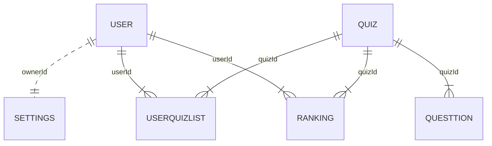

# Android Quiz

[](https://github.com/tterb/atomic-design-ui/blob/master/LICENSEs)
[](https://github.com/Naereen/badges/)
 
## Table of contents
* [General info](#general-info)
* [Technologies](#technologies)
* [Roadmap](#roadmap)
* [Features](#features)
* [Code Parts](#code-parts)
* [DB Parts](#db-parts)
* [Related](#related)
## General info
**_Android Quiz_**  -- quiz project with login and registration system, it connected to DB where saved information about users and questions, all results will be saved also in DB.
 
 
  
## Technologies
Project is created with:
* Android Studio: 4.2.1
* Android Api: 29
* SQLite Database
  
## Roadmap

* [X] DB Connecting
* [X] Login/Registration System
* [ ] Quiz Menu
* [ ] Create Quiz System 
* [ ] Quiz part
* [ ] Register Results
* [ ] LeaderBoard
* [ ] Settings 


## Features


* DB Connecting   
    * Created project settings where place connecting string
* Login/Registration System
    * Make Login and Registration system with password and profile 
* Quiz Menu
    * List of Quizzes
    * Public Quizzes
    * User Quizzes
    * Manage user-created Quizzes
        * Create
        * Update
        * Remove
        * Make Private (using password)
        * Make Public
        * Is show correct ansver Flag 
    * Search By Name or By Quiz ID
* Create Quiz System 
    * Get random questions from DB 
    * Get answers for this question and random variants 
    * Check answers 
* Quiz part
    * Text Quiz with one answer
    * Calculate points and update data in DB
    * Show correct (if Flag )
* Register Results
    * At the end of Quiz show Results
* Leaderboard
    * Show Leaderboard of Quiz
* Settings 
    * Colors
## Code Parts

### Models

<details><summary>User Model</summary>
<p> 

  ```
  public class User {
      public int id;
      public String name;
      public String password;  
      private UserSetting settings;
      public void setSetting(int settingId){}
      public UserSetting getSetting(){return settings;}
  }
  ```
</p>
</details>

<details><summary>Quiz Model</summary>
<p>  
  
  ```
  public class Quiz {
      public int id;
      public int ownerId;
      public String name;
      public String password;
      public bool isPasswordRequered;
      public bool isPublic;  
      public int maxQuestions; 
      public bool showCorrect; 
      private List<Question> questionsDone;
      private List<Question> questions;
      public void initQuestions(){}
      public Question GetQuestion(){} 
  }
  ```
  
</p>
</details>
  
<details><summary>Question Model</summary>
<p>  
  
  ```
  public class Question {
      public int id; 
      public String description;
      public String answer; 
      public List<String> variants;   
      public bool isCorrect; 
  }
  ```
  
</p>
</details>
<details><summary>Settings Model</summary>
<p>   
  
  ```
  public class Settings {
      public int id; 
      public int ownerId; 
      //different settings
      public void Init(){} 
      public void Save(){}
      public void Read(){}
  }
  ```
  
</p>
</details>

## DB Parts

It this part you can read about DB tables and relations between them
  
Here is a simple flow chart:


 
### Connection to DB
 **Connection was created only to show how DB can be connected to Androi App, it should not be used in comercial becouse of security problem**
if you whant secure your app pleas use server with RestAPI

<details><summary>Connection to DB</summary>
<p>  
 Before you will add this code need add mysql-connector-java-5.1.20-bin.jar to your lib folder (app/libs/mysql-connector-java-5.1.20-bin.jar)
 Download only version 5.1.20 from site [downloads.mysql.com archives](https://downloads.mysql.com/archives/c-j/)

 In **url** enter server in format "jdbc:mysql://[DB Server]/[DB Name]"
 If you run on local PC your DB Server should be your PC IP, it will be also work if PC in same network where android device 
 
 In **username** enter DB User with access from all IP (values '%' or '0:0:0:0')
 
```
    private static final String LOG = "DEBUG";
    private static String classjdbcDriver = "net.sourceforge.jtds.jdbc.Driver";

    private static String url = "jdbc:mysql://192.168.1.20/android_quiz";
    private static String username = "java";
    private static String password = "password";
    String res = "";
    private static Connection connection() {
        StrictMode.ThreadPolicy policy = new StrictMode.ThreadPolicy.Builder().permitAll().build();
        StrictMode.setThreadPolicy(policy);

        try {
            Class.forName("com.mysql.jdbc.Driver"); // Add DB Driver to program
            System.out.println("Driver loaded!");
            Connection connection = DriverManager.getConnection(url, username, password);
            System.out.println("Database connected!");
            return connection;
        } catch (SQLException | ClassNotFoundException e) {
            throw new IllegalStateException("Cannot connect the database!", e);
        }
    }
```
 
</p>
</details>

### SQL Requests
<details><summary>Select Request</summary>
<p>

```
    public static User LogIn( String login, String password){

        try{
            Connection con = connection(); //Get DB Connection 
            String sql;
            sql  = "SELECT Id,Name FROM users WHERE Name =? And Password = ?"; // '?' places for parameters
            PreparedStatement prest = con.prepareStatement(sql);
            prest.setString(1,login);
            prest.setString(2,password);
            User result = new User();
            ResultSet rs = prest.executeQuery(); 
            if (rs.next()){
                result.Id = rs.getInt("Id");
                result.Login = rs.getString("Name");

                System.out.println(result.Id + "\t" + "- " + result.Login);

            }
            prest.close(); // important to close reader
            con.close();// important to close connections
            return result;
        }
        catch (SQLException s){
            System.out.println("SQL statement is not executed!");
            System.out.println(s.getMessage());

        }

        return null;
    }

```
 
</p>
</details>
 
## Related

Here are some related projects

[geeksforgeeks/android-tutorial](https://www.geeksforgeeks.org/android-tutorial/)

[tutorialspoint/android_sqlite_database](https://www.tutorialspoint.com/android/android_sqlite_database.htm)

[developer.android/layout-editor](https://developer.android.com/studio/write/layout-editor)

[code.tutsplus/build-an-interactive-quiz-app](https://code.tutsplus.com/tutorials/android-ui-workshop-build-an-interactive-quiz-app--mobile-14208)

