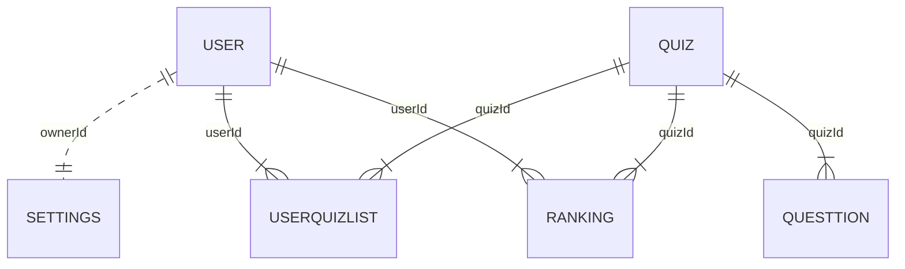

# Android Quiz

[](https://github.com/tterb/atomic-design-ui/blob/master/LICENSEs)
[](https://github.com/Naereen/badges/)
 
## Table of contents
* [General info](#general-info)
* [Technologies](#technologies)
* [Roadmap](#roadmap)
* [Features](#features)
* [Code Parts](#code-parts)
* [DB Parts](#db-parts)
* [Related](#related)
## General info
**_Android Quiz_**  -- quiz project with login and registration system, it connected to DB where saved information about users and questions, all results will be saved also in DB.
 
 
  
## Technologies
Project is created with:
* Android Studio: 4.2.1
* Android Api: 29
* SQLite Database
  
## Roadmap

* [ ] DB Connecting
* [ ] Login/Registration System
* [ ] Quiz Menu
* [ ] Create Quiz System 
* [ ] Quiz part
* [ ] Register Results
* [ ] LeaderBoard
* [ ] Settings 


## Features


* DB Connecting   
    * Created project settings where place connecting string
* Login/Registration System
    * Make Login and Registration system with password and profile 
* Quiz Menu
    * List of Quizzes
    * Public Quizzes
    * User Quizzes
    * Manage user-created Quizzes
        * Create
        * Update
        * Remove
        * Make Private (using password)
        * Make Public
        * Is show correct ansver Flag 
    * Search By Name or By Quiz ID
* Create Quiz System 
    * Get random questions from DB 
    * Get answers for this question and random variants 
    * Check answers 
* Quiz part
    * Text Quiz with one answer
    * Calculate points and update data in DB
    * Show correct (if Flag )
* Register Results
    * At the end of Quiz show Results
* Leaderboard
    * Show Leaderboard of Quiz
* Settings 
    * Colors
## Code Parts

### Models

<details><summary>User Model</summary>
<p> 

  ```
  public class User {
      public int id;
      public String name;
      public String password;  
      private UserSetting settings;
      public void setSetting(int settingId){}
      public UserSetting getSetting(){return settings;}
  }
  ```
</p>
</details>

<details><summary>Quiz Model</summary>
<p>  
  
  ```
  public class Quiz {
      public int id;
      public int ownerId;
      public String name;
      public String password;
      public bool isPasswordRequered;
      public bool isPublic;  
      public int maxQuestions; 
      public bool showCorrect; 
      private List<Question> questionsDone;
      private List<Question> questions;
      public void initQuestions(){}
      public Question GetQuestion(){} 
  }
  ```
  
</p>
</details>
  
<details><summary>Question Model</summary>
<p>  
  
  ```
  public class Question {
      public int id; 
      public String description;
      public String answer; 
      public List<String> variants;   
      public bool isCorrect; 
  }
  ```
  
</p>
</details>
<details><summary>Settings Model</summary>
<p>   
  
  ```
  public class Settings {
      public int id; 
      public int ownerId; 
      //different settings
      public void Init(){} 
      public void Save(){}
      public void Read(){}
  }
  ```
  
</p>
</details>

## DB Parts

It this part you can read about DB tables and relations between them
  
Here is a simple flow chart:



## Related

Here are some related projects

[geeksforgeeks/android-tutorial](https://www.geeksforgeeks.org/android-tutorial/)

[tutorialspoint/android_sqlite_database](https://www.tutorialspoint.com/android/android_sqlite_database.htm)

[developer.android/layout-editor](https://developer.android.com/studio/write/layout-editor)

[code.tutsplus/build-an-interactive-quiz-app](https://code.tutsplus.com/tutorials/android-ui-workshop-build-an-interactive-quiz-app--mobile-14208)

